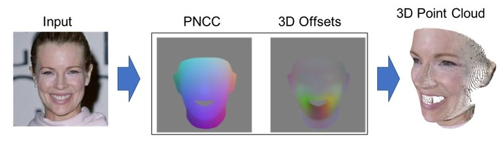

# pix2face_net

__Note__: For a complete 3D face geometry estimation and rendering solution with documentation, see [pix2face](https://github.com/VisionSystemsInc/pix2face), which contains this repository as a submodule.

### Direct Estimation of 3D Face Pose and Geometry from 2D Images


## Requirements
* [pytorch](http://pytorch.org)
* [numpy](http://www.numpy.org)
* [scikit-image](http://scikit-image.org)
* Training Data

  You will need three sets of training images: Input, PNCC, and offsets.

  * Input: The input RGB face image.

  * PNCC: "Projected Normalized Coordinate Code", as described in [1]

  * Offsets: 3D offsets from the "mean face" position to the observed 3D position.

\[1\] X. Zhu, Z. Lei, X. Liu, H. Shi, and S. Z. Li, “Face Alignment Across Large Poses: A 3D Solution”, CVPR 2016.

## Training
```
python train.py --input_dir $INPUT_DIR --PNCC_dir $PNCC_DIR --offsets_dir $OFFSETS_DIR \
--val_input_dir $VAL_INPUT_DIR --val_PNCC_dir $VAL_PNCC_DIR --val_offsets_dir $VAL_OFFSETS_DIR \
--output_dir $OUTPUT_DIR
```

## Testing
```
python test.py --model $OUTPUT_DIR/pix2face_unet.pth \
--input <image_or_directory> --output_dir <output_dir>
```

## Demo
See demo.py for an example of a transformation from image --> PNCC + offsets --> 3D Point Cloud.

In order to run the demo, you will need to train the network or download a pre-trained model.

## Citation
If you find this software useful, please consider referencing:

```bibtex
@INPROCEEDINGS{pix2face2017,
author = {Daniel Crispell and Maxim Bazik},
booktitle = {2017 IEEE International Conference on Computer Vision Workshop (ICCVW)},
title = {Pix2Face: Direct 3D Face Model Estimation},
year = {2017},
pages = {2512-2518},
ISSN = {2473-9944},
month={Oct.}
}
```

## Contact
Daniel Crispell [dan@visionsystemsinc.com](mailto:dan@visionsystemsinc.com)
